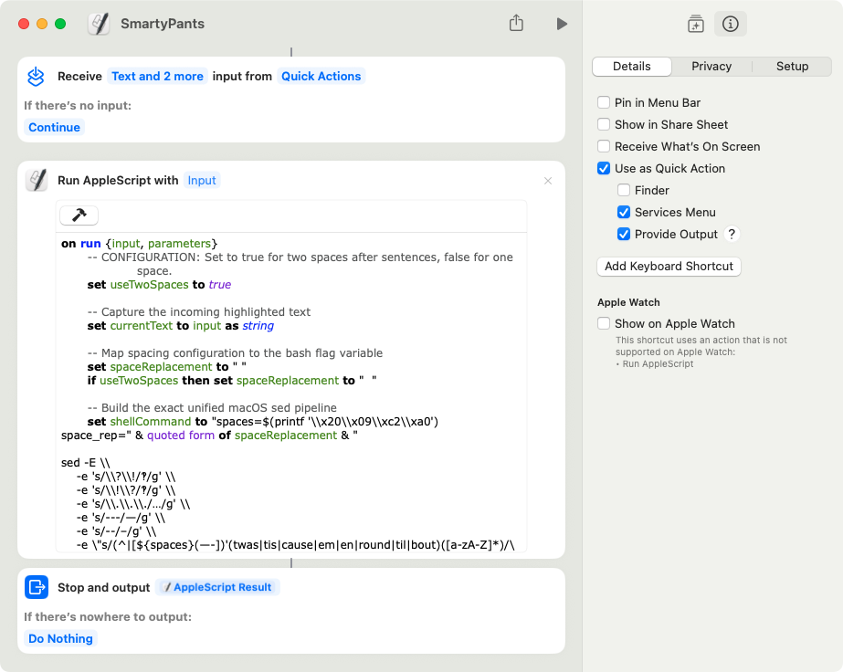

# SmartyPants

A pair of lightweight, idempotent scripts (Bash & macOS AppleScript/Shortcuts) designed to automatically upgrade standard text into beautiful, typographically correct prose. 

It handles curly quotes, proper dashes, ellipses, word-omission contractions, handles spacing standardization, and includes a fun little interrobang easter egg.

## Features

* **Smart Quotes:** Converts straight quotes (`'`) and (`"`) to their curly counterparts (`‘`, `’`, `“`, `”`).
* **Contraction Awareness:** Properly preserves leading apostrophes for historical contractions like `'twas`, `'tis`, `'cause`, `'em`, and truncated years like `'98`.
* **Dashes & Ellipses:** Converts `--` to an en-dash (`–`), `---` to an em-dash (`—`), and `...` to an ellipsis (`…`).
* **Whitespacing QOL:** Automatically trims accidental spaces trailing right before punctuation marks.
* **Sentence Spacing Normalization:** Cleans up irregular spacing after sentences, supporting both modern single-space standards and classic double-space typography.
* **Idempotent:** Safe to run repeatedly on the same block of text without risking recursion or broken formatting.
* **Easter Egg:** Converts `!?` or `?!` into a glorious interrobang (`‽`).

---

## Installation & Usage

### 1. Bash Script (`smartypants.sh`)
Perfect for command-line efficiency, treating text processing like a fast conveyor belt.

**Civilized Mode (Default):**
By default, the script normalizes all sentence endings (`.`, `?`, `!`, and `‽`) to use exactly **one space**.
```bash
echo "Stop!  Who goes there?!  Wait..." | ./smartypants.sh
# Output: Stop! Who goes there‽ Wait…
```

**Heathen Mode (--two-space):**
For traditionalists or specific style guides, passing the --two-space flag forces exactly two spaces after all sentence-ending punctuation (including the interrobang).
```bash
./smartypants.sh --two-space input.txt > output.txt
```

### 2. macOS Quick Action / Shortcut
Bring typographic fixes to any text field across macOS via a Services menu or keyboard shortcut.

1. Open the **Shortcuts** app on macOS.
2. Go to the Shortcuts menu > Settings… and in the Advanced tab, select "Allow Running Scripts".
3. Create a new **Quick Action** and name it SmartyPants.
4. Click the blue input token at the very top and ensure it is filtered to receive only **Text** and **Rich text**. 
3. Leave the source token set to **Quick Actions** (this is macOS shorthand for "any application" via the system Services framework).
4. In the right-hand inspector panel under the **Details** tab, verify that both **Use as Quick Action -> Services Menu** and **Provide Output** are checked. Optionally, add a keyboard shortcut in the "Run with" field.
5. Search for and add a **Run AppleScript** action, then paste the script provided in this repository.
6. Ensure the output is "AppleScript Result".
7. Highlight any text on your Mac, right-click -> **Services** -> **SmartyPants** (or use your chosen keyboard shortcut) to instantly clean your typography in place!

> **Spacing Configuration:** The AppleScript shares the exact same typographic engine as the Bash variant. To toggle your sentence-spacing preferences, simply edit the configuration property at the absolute top of the AppleScript file:
> * For classic double-spacing (Heathen Mode): `property useTwoSpaces : true`
> * For modern single-spacing (Civilized Mode): `property useTwoSpaces : false`



---

## Limitations: Source Code & Markdown Warning (Read Before Use) ⚠️

Because these scripts rely purely on regex pattern-matching substitutions via a macOS-compatible `sed` engine rather than an abstract syntax tree (AST) parser, **they do not recognize code blocks or HTML tags.** Running these scripts directly over raw Markdown files containing code or HTML files with inline attributes will "smart-quote" your code syntax and break it. Please use it as intended: on raw prose, markdown text nodes, or drafts.

### Why it WILL break source code:
* **Syntax Mangling:** It will blindly convert standard straight quotes (`'` and `"`) inside string literals, attributes, or terminal commands into typographic curly quotes (`‘`/`“`), which will cause compilation errors or syntax crashes in almost every programming language.
* **Destructive Whitespace Normalization:** The quality-of-life adjustments that strip sloppy spacing around punctuation and closing brackets (e.g., transforming `word )` into `word)`) will mercilessly collapse intentional, structural formatting inside code matrices, function arguments, or list objects (e.g., breaking `[ 1, 2, 3 ]` or `my_function( arg1 )`).

### HTML & Markdown Elements
This utility is completely blind to Markdown syntax blocks and HTML tags. Running it globally over a raw document will ruin inline HTML attributes (like `href="url"`) and smart-quote code expressions inside block indicators.

### How to use it safely:
1. **Isolate Text Drafts:** Restrict CLI scripts exclusively to raw, text-only prose directories, draft files, or specialized `/docs` folders.
2. **Never Run Globally:** Avoid running the script blindly via recursive loops over an entire repository root (e.g., do not pipe a global `find .` command into the script).
3. **Utilize the macOS Service Variant:** The macOS Quick Action/Shortcut is structurally the safest way to leverage this utility. Because it operates entirely on your **active manual text highlight**, you retain 100% granular control—allowing you to easily skip highlighting code fences, inline tags, or technical blocks while polishing your prose.

---

## For the curious (and regex averse) 🤓

If you look at the raw `sed` pipeline shared across both `smartypants.sh` and the AppleScript block, it looks like a cat ran across a keyboard. However, it is actually a highly orchestrated, line-by-line typographic assembly line.

Before the engine runs, a variable named `${spaces}` is prepared behind the scenes. It evaluates to the raw, invisible hex bytes for a standard space, a tab character, and a web non-breaking space (`\x20\x09\xc2\xa0`). This ensures that no matter where you copied your text from, the engine will detect the whitespace.

Here is exactly what every single rule is doing, in order:

### 1. The Low-Hanging Fruit (Symbol Conversions)
* **`-e 's/\?\!/‽/g'`** & **`-e 's/\!\?/‽/g'`**
  Looks for literal `?!` or `!?` combinations and replaces them globally (`g`) with a beautiful, single-character interrobang (`‽`).
* **`-e 's/\.\.\./…/g'`**
  Finds three consecutive periods and swaps them for a professional, single-glyph typographic ellipsis (`…`).
* **`-e 's/---/—/g'`** & **`-e 's/--/–/g'`**
  Converts triple hyphens into long Em dashes (`—`) and double hyphens into medium En dashes (`–`).

### 2. Slang & Contractions (The Single Quotes)
* **`-e "s/(^|[${spaces}(—-])'(twas|tis|cause|em|en|round|til|bout)([a-zA-Z]*)/\1’\2\3/gi"`**
  Finds common abbreviated slang words that start with an apostrophe (like *'twas*, *'tis*, *'cause*, *'em*, *'round*). It ignores case (`i`) and ensures the apostrophe curls right (`’`) rather than left (`‘`).
* **`-e "s/([a-zA-Z0-9])'([a-zA-Z])/\1’\2/g"`**
  Standard contractions and possessives. If an apostrophe is sandwiched tightly between alphanumeric characters (like *don't*, *it's*, or *user's*), it forces it to become a curly right apostrophe (`’`).
* **`-e "s/'([0-9]{2})/’\1/g"`**
  Catches two-digit shorthand decades (like *'90s* or *'26*) and curls the apostrophe to the right (`’`), stopping it from mistakenly becoming a left quote.

### 3. Smart Quotes (Contextual Boundaries)
* **`-e "s/(^|[([{\\\"${spaces}—-])'([a-zA-Z0-9])/\\1‘\\2/g"`**
  **Left Single Quotes:** If an apostrophe is at the very beginning of a line (`^`), or immediately follows an opening bracket, opening quote, space, or dash, it is a word-*opening* boundary. It gets converted to an open single quote (`‘`).
* **`-e "s/([a-zA-Z0-9.,?!;:‽…])'([]}\\\"${spaces}—.,;:?!)]|$)/\\1’\\2/g"`**
  **Right Single Quotes:** If an apostrophe is right after a word or punctuation mark, and is followed by a closing bracket, closing quote, space, dash, or trailing sentence punctuation, it is a word-*closing* boundary. It becomes a closed single quote (`’`). *Note: This explicitly accommodates logical/British-style punctuation variants where a comma or period sits outside the quote block (e.g., `'word'.` or `'word',`).*
* **`-e "s/(^|[([{${spaces}—-])\"([a-zA-Z0-9‘])/\\1“\\2/g"`** & **`-e "s/([a-zA-Z0-9.,?!;:’‽…])\"([]}\\\"${spaces}—.,;:?!)]|$)/\\1”\\2/g"`**
  **Double Quotes:** Applies the exact same boundary philosophy as above, turning standard straight double quotes (`"`) into elegant left-opening (`“`) and right-closing (`”`) typographic double quotes, regardless of whether punctuation sits inside or outside the text bounds. This keeps both Brits and Yanks happy.
  
> **The macOS Quirks Mode:** You will notice closing brackets at the very beginning of character groups (like `[]}]`). Because macOS `sed` completely ignores standard backslash escapes inside character classes, pulling the closing bracket `]` to the absolute front of the array is a mandatory hack to make `sed` treat it as a literal character rather than an instruction to close the regex group early.

### 4. Whitespace Quality-of-Life Cleanups
* **`-e "s/[${spaces}]+([.,?!;—…‽])/\1/g"`**
  Scans the text for sloppy, accidental spaces sitting right before commas, periods, or other primary punctuation marks, and obliterates them.
* **`-e "s/[${spaces}]+([’”])([^a-zA-Z0-9]|$)/\1\2/g"`**
  **The Contraction Protector Rule:** Strips extra spaces before curly quotation marks, but *only* if the quote isn't immediately followed by an alphanumeric character. This crucial check allows the engine to clear messy text layout spacing without accidentally swallowing spaces before leading slang shortcuts (preserving things like `and ’tis` instead of destroying it into `and’tis`).
* **`-e 's/ !/!/g' -e 's/ \?/?/g' -e 's/ ‽/‽/g'`**
  A strict, foolproof safety pass to make sure no loose spaces remain attached to the front of exclamation points, question marks, or interrobangs.
* **`-e "s/[${spaces}]+([]})])/\1/g"`**
  **Bracket Closer Rule:** Automatically finds any spaces floating right before a closing parenthesis `)`, closing bracket `]`, or closing brace `}`, collapsing them completely (e.g., changing `(text )` to `(text)`).

### 5. Sentence Normalization (The Grand Finale)
* **`-e "s/([.?!‽][]'\"’”)]*)[${spaces}]+([^])}‘“'\"[:cntrl:]])/\1${SPACE_REPLACEMENT}\2/g"`**
  **The Spacer Normalizer:** Looks for sentence-ending punctuation (`.?!‽`) and normalizes trailing whitespace to match your preference (either 1 space, or 2 spaces). The inclusion of the nested `[]'\"’”)]*` group allows the engine to swallow any trailing quotation marks or closing brackets that sit directly on the lip of a sentence boundary. This prevents dialogue blocks (like `“Stop!”  He yelled.`) from breaking or intercepting the engine's core normalization logic.
* **`-e "s/([.?!‽])[${spaces}]+([]})])/\1\2/g"`**
  **The Punctuation Smasher:** If sentence-ending punctuation is immediately followed by trailing whitespace and a closing paren/bracket, this rule aggressively deletes that space, smashing the punctuation flush against the inner lip of the closing bracket (e.g., transforming `(heathen!! )` to `(heathen!!)`).

---

## Acknowledgments & Inspiration

This project owes a profound debt of gratitude to **[John Gruber]([url](https://daringfireball.net))** and his [original 2003 implementation of SmartyPants]([url](https://daringfireball.net)). 

Gruber’s OG web publishing utility paved the way for modern web typography by proving that web writers shouldn't be held hostage by the limitations of the standard QWERTY keyboard layout. This utility stands on the shoulders of that classic implementation, adapting those core smart-punctuation principles into a nimble, dual-pronged workflow for modern CLI and macOS environments.
